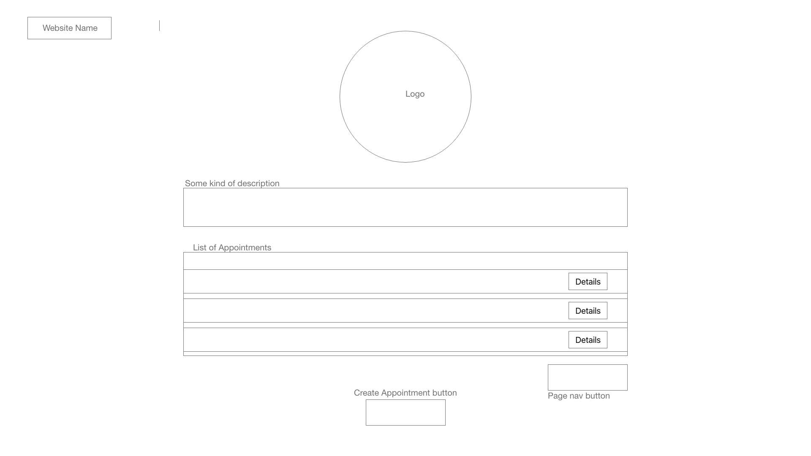

# Doctor's appointment

### As a user(the doctors' assistant) I should be able to:
  - See all the appointments I have on the main page
    - See the name of the patient, location of the appointment, date and start time, and the **Details** button.
      - When clicking the "Details", I should be able to see more details for the appointment.
        - See the Patient's Name (and Phone, Email, Address), Doctor's Name (and Phone, email), Location, Appointment Date, Appointment Reason, Appointment Duration
    - See only 10 appointments per page and a page navigation button on the bottom right.
  - See the "Create Appointment" button on the bottom center, beneath the appointment list   
    - Create Appointment by clicking the button navigating to Create Appointment page.
      - Fill in the forms with relevant info.
      - Click Submit button to save.
      - See the updated appointment list on the main page.


## TODO:
- [ ] Task 1
- [ ] Task 2
- [ ] Task 3
- [ ] Task 4
- [ ] Task 5

## Directory:
```
.
├── README.md
├── package-lock.json
├── package.json
├── public
│   ├── favicon.ico
│   ├── index.html
│   ├── logo192.png
│   ├── logo512.png
│   ├── manifest.json
│   └── robots.txt
└── src
    ├── App.css
    ├── App.js
    ├── App.test.js
    ├── index.css
    ├── index.js
    ├── logo.svg
    ├── reportWebVitals.js
    └── setupTests.js
```

## Wireframe
#### Main Page

#### Details Page

#### Create Appointment Page


## Available Scripts

In the project directory, you can run:

### `npm start`
Runs the app in the development mode.\
Open [http://localhost:3000](http://localhost:3000) to view it in your browser.

### `npm run build`

### `npm run eject`

This project was bootstrapped with [Create React App](https://github.com/facebook/create-react-app).
