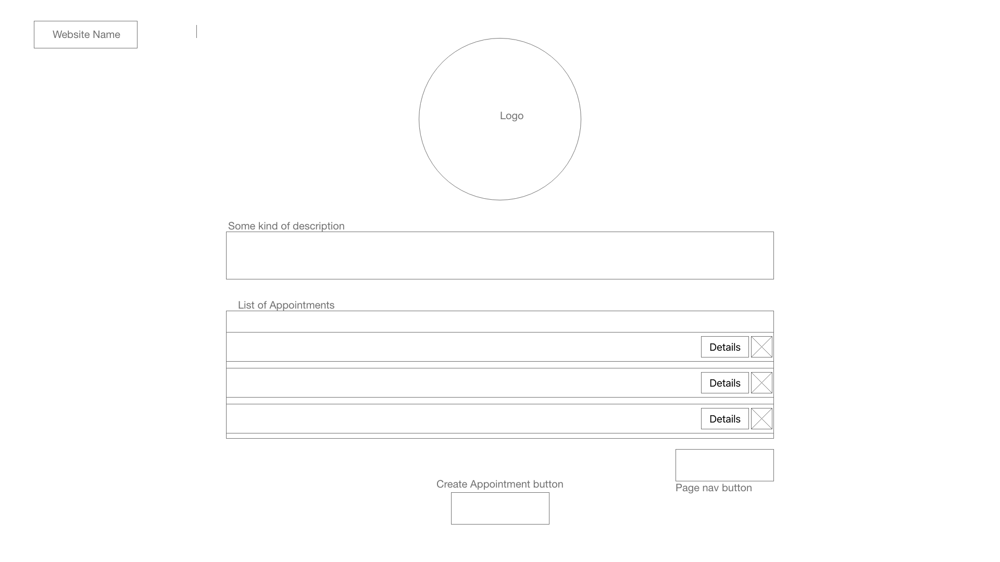
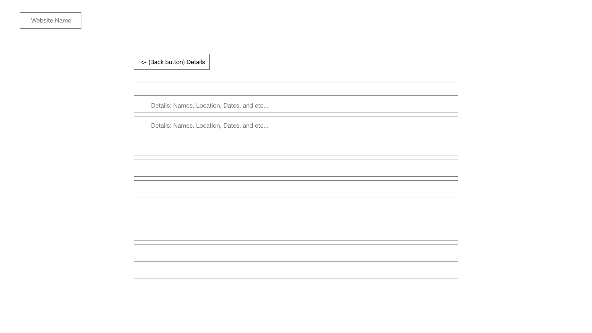
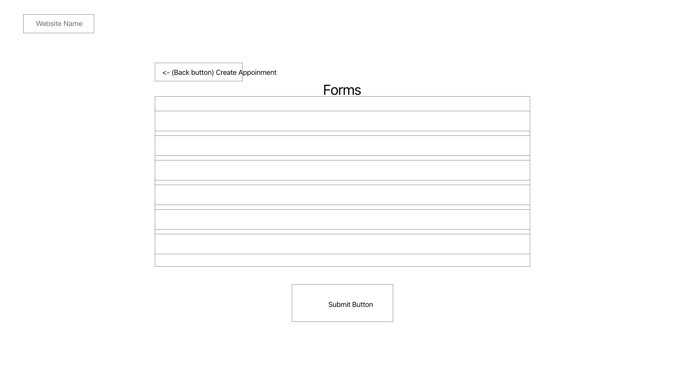

# Doctor's appointment

# DEVELOPMENT BRANCH

## As a user(the doctors' assistant) I should be able to:

- See all the appointments I have on the main page
  - See the name of the patient, location of the appointment, date and start time, and the **Details** button.
    - When clicking the "Details", I should be able to see more details for the appointment.
      - See the Patient's Name (and Phone, Email, Address), Doctor's Name (and Phone, email), Location, Appointment Date, Appointment Reason, Appointment Duration
  - See only 10 appointments per page and a page navigation button on the bottom right.
- See list of profiles for doctors and patients in a separate page.
- See the "Create Appointment" button on the bottom center, beneath the appointment list
  - Create Appointment by clicking the button navigating to Create Appointment page.
    - Fill in the forms with relevant info.
    - Click Submit button to save.
    - See the updated appointment list on the main page.

## Pages: 
- App.js 
  - Home
  - Displays a list of appointments
- Doctors.js 
  - Displays a list of doctors
- Patients.js
  - Displays a list of patients
- CreateAppointment.js
  - Create appointment here with forms

## Components:
- Navbar
- Logo
- Description
- AppointmentList
  - DetailsButton
  - DeleteAppointmentButton
  - CreateAppointmentButton
  - AppointmentNav
- DoctorList
- PatientList
- BackButton


## TODO:

- [x] Add delete button next to details button on wireframes
- [ ] Add Pages

## Directory:

```
.
├── README.md
├── package-lock.json
├── package.json
├── public
│   ├── favicon.ico
│   ├── index.html
│   ├── logo192.png
│   ├── logo512.png
│   ├── manifest.json
│   ├── robots.txt
│   └── wireframes
│       ├── AppointmentDetails.png
│       ├── CreateAppointmentForm.png
│       └── MainPage.png
└── src
    ├── App.css
    ├── App.js
    ├── App.test.js
    ├── index.css
    ├── index.js
    ├── logo.svg
    ├── reportWebVitals.js
    └── setupTests.js

3 directories, 20 files
```

## Wireframe

#### Main Page



#### Appointment Detail Page



#### Doctor Profile Page


#### Patient Profile Page


#### Create Appointment Page



## Available Scripts

In the project directory, you can run:

### `npm start`

Runs the app in the development mode.\
Open [http://localhost:3000](http://localhost:3000) to view it in your browser.

### `npm run build`

### `npm run eject`

This project was bootstrapped with [Create React App](https://github.com/facebook/create-react-app).
